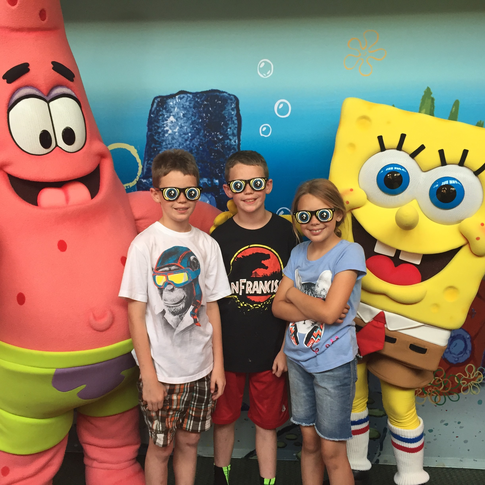
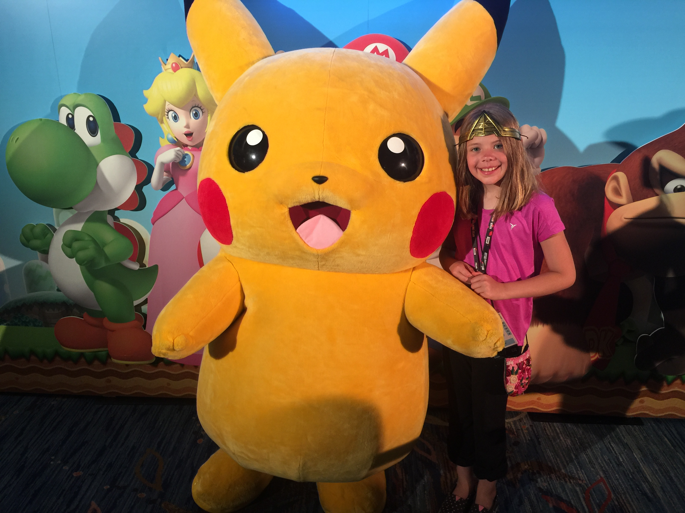
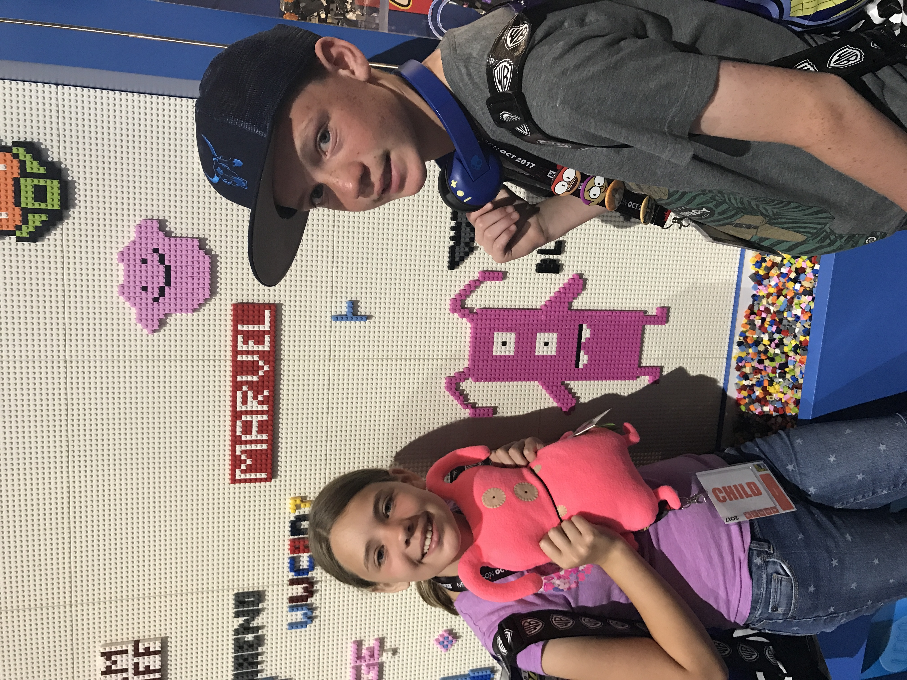
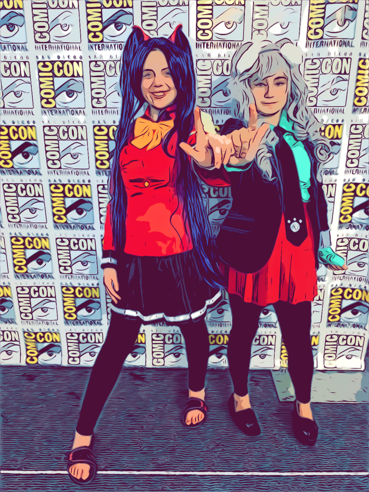
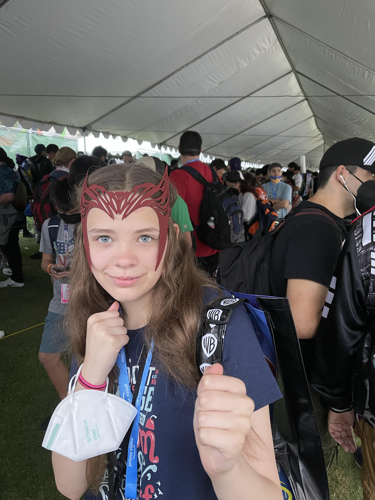
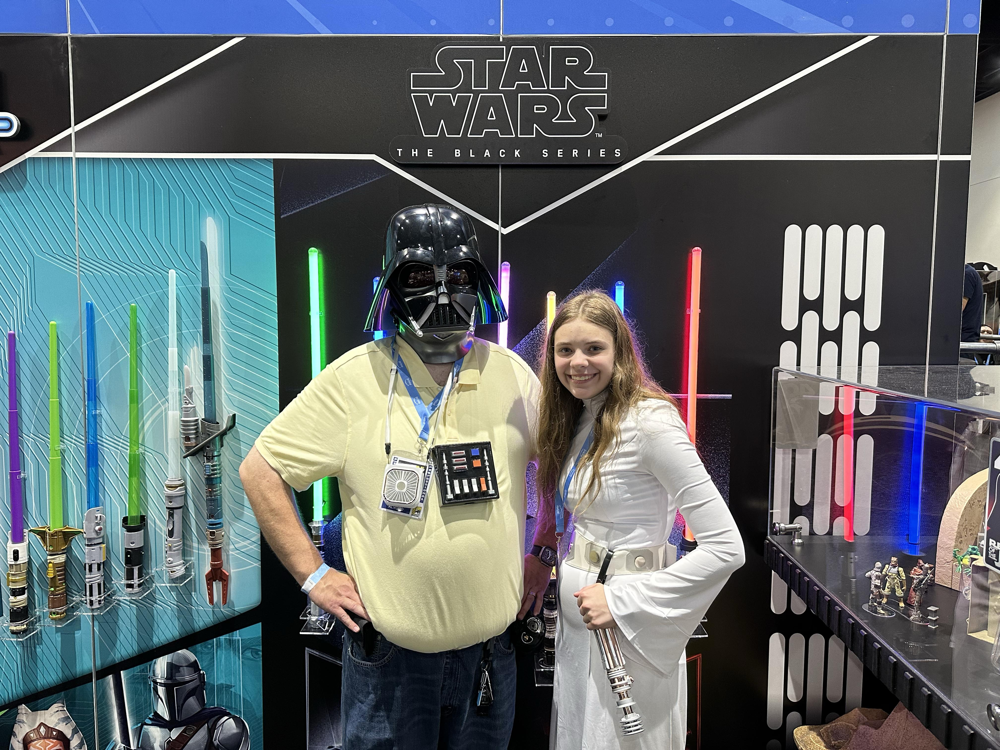

<!DOCTYPE html>
<html lang="en">
<head>
  <meta charset="UTF-8">
  <title>Comic-Con Anniversary</title>
  
</head>
<body>

  <h1>Comic-Con Anniversary Reflection</h1>

  
This July will mark a very important anniversary for me. This marks my tenth consecutive year attending the San Diego Comic-Con. I feel fortunate to have been able to attend so many with my family. This event has not only been fun but also helped shape me to who I am today.

  
Here are some of my favorite experiences from attending, and the years they are from:

  <ul>
    <li><strong>2015</strong> 
      
    </li>
    <li><strong>2016</strong> 
      
    </li>
    <li><strong>2017</strong> 
      
    </li>
    <li><strong>2019</strong> 
      
    </li>
    <li><strong>2022</strong> 
      
    </li>
    <li><strong>2023</strong> 
      
    </li>
    <li><strong>2024</strong> 
      
    </li>
  </ul>

  
Over the years, attendance at the San Diego Comic-Con has increased significantly.

  
Sometimes it brings in hundreds of thousands more than can even attend the conference and participate in what are called off-sites, which are typically free to go to and will give out free swag to visitors.

</body>
</html>
